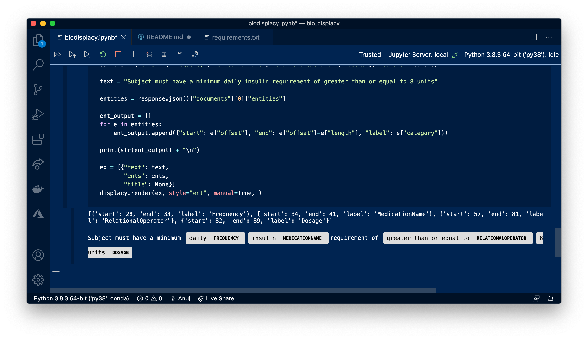

# 👩🏽‍⚕️ BioMedical NLP + spaCy
### With Azure Text Analytics for Health

This Jupyter notebook will show you how to get started deploying the Text Analytics for Health container service to an Azure Web App, and visualize entities and entity linkages the results using spaCy's displaCy library.

### ✅ Requirements
You'll need the following installed, but we'll check for it in the Jupyter notebook

- [Azure CLI](https://docs.microsoft.com/en-us/cli/azure/install-azure-cli?view=azure-cli-latest)
- Python 3.8.x 
- [Jupyter + VS Code](https://code.visualstudio.com/docs/python/jupyter-support)
- Access to [Text Analytics for Health](https://forms.office.com/Pages/ResponsePage.aspx?id=v4j5cvGGr0GRqy180BHbRyQZ7B8Cg2FEjpibPziwPcZUNlQ4SEVORFVLTjlBSzNLRlo0UzRRVVNPVy4u)

### 🎯 Usage 

- Open the Jupyter Notebook (bionlp.ipynb)
- Deploy the BioMedical NLP container to Azure ☁️
- Satisfy requirements.txt 
- Run through the cells

## License:

Apache 2.0